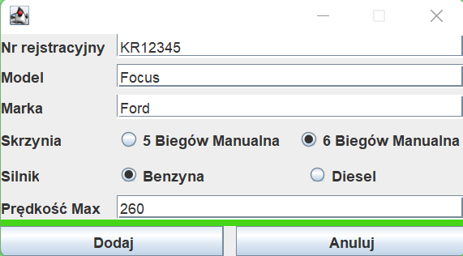
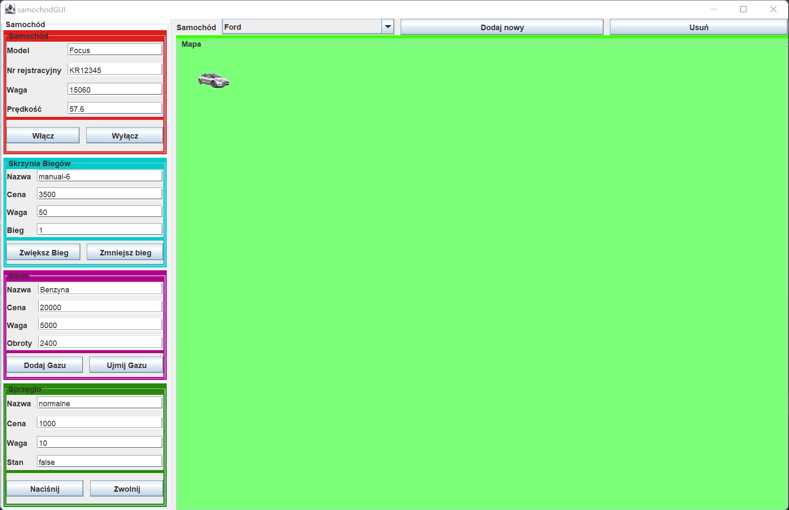

# CarSimulator

## Table of contents
* [General info](#general-info)
* [Features](#features)
* [Technologies](#technologies)

## General info
CarSimulator is a simple GUI application, where we can move our car on the map. This app uses threads so we can drive a few cars at the same time. 

## Features
- Creating a new car with details

- driving
- positing to a destination on the map (MouseListener)
- adding gas
- gear changing
- breaking
- having a few cars at the same time
- switching car (ComboBox)
- setting car parameters

## Technologies
App was created with:
- Java 
- Threads
- GUI
